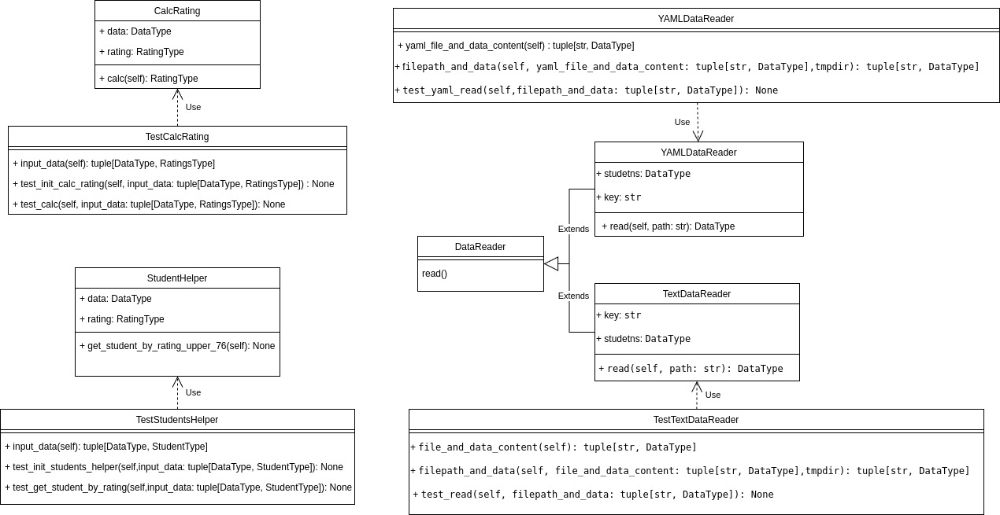

# Лабораторная 1 по дисциплине "Технологии программирования"

## Вариант 6
### Задание
Необходимо считывать файлы с раширением `*.yaml`.
Определить и вывести на экран студента, имеющего 76 баллов минимум по трем дисциплинам. Если таких студентов несколько, нужно вывести любого из них. Если таких студентов нет, необходимо вывести сообщение об их отсутствии.

Чтобы запустить необходимо в директории `src` запустить `python main.py -p ../data/data.yaml`

## UML диаграмма классов
